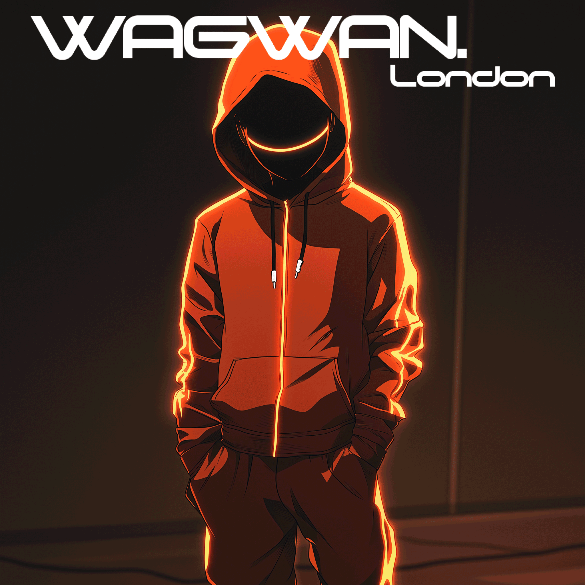
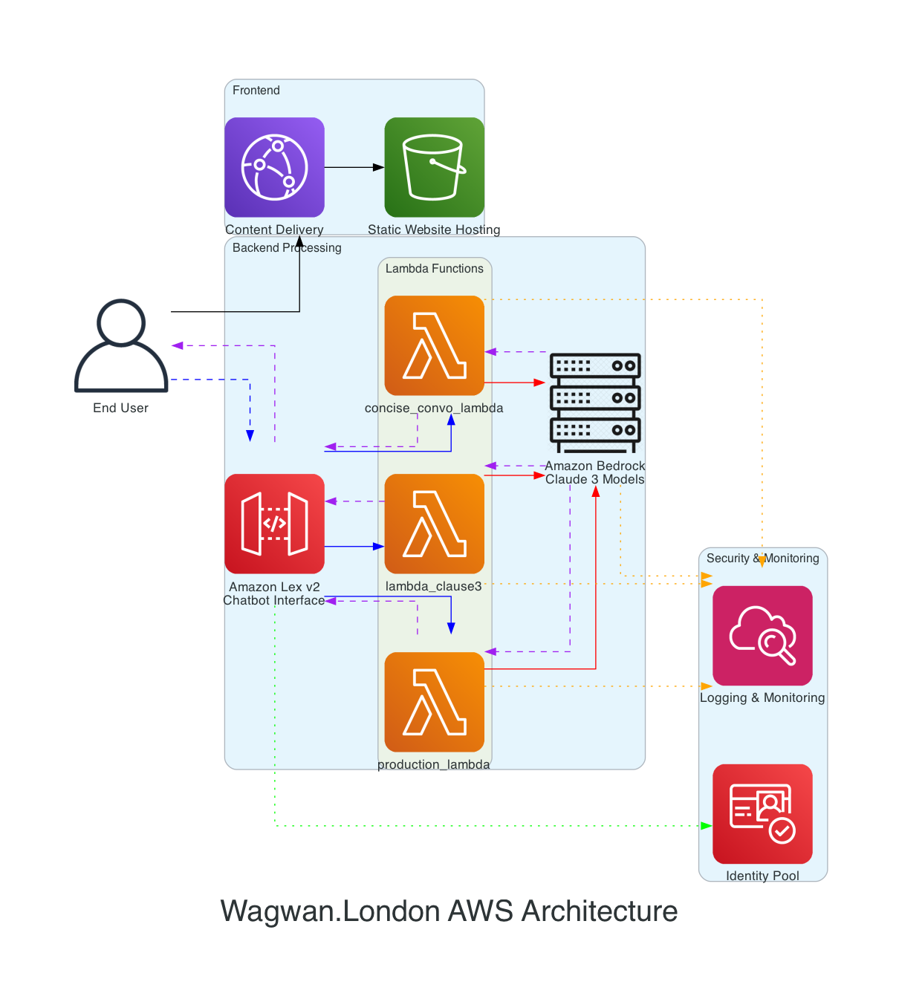

# WAGWAN.LONDON

## A Cloud-Native Conversational AI with a South London Cultural Flair

## Table of Contents

- [Overview](#overview)
- [Architecture](#architecture)
  - [Key AWS Services Utilized](#key-aws-services-utilized)
- [Technical Highlights](#technical-highlights)
  - [Serverless Architecture](#serverless-architecture)
  - [Natural Language Understanding](#natural-language-understanding)
  - [Front-End Innovation](#front-end-innovation)
- [Security & Compliance](#security--compliance)
- [Performance Optimization](#performance-optimization)
- [Outcome & Business Value](#outcome--business-value)
- [Lessons & Insights](#lessons--insights)
- [Future Enhancements](#future-enhancements)
- [Contact](#contact)

## Overview

WAGWAN.LONDON demonstrates advanced implementation of AWS cloud services to create a culturally relevant and authentic conversational AI experience. The application showcases a fully serverless architecture that leverages AWS's most cutting-edge AI/ML services.

The chatbot embodies the voice of South London youth culture and swagger with authentic dialect, slang, and conversational patterns. This project highlights my skillset in:

- Serverless application architecture on AWS
- Integration of advanced AWS AI/ML services
- High-performance, scalable cloud solutions
- Cultural AI persona development and language modeling

## Architecture

### Key AWS Services Utilized

| Service | Implementation |
|---------|----------------|
| **Amazon Bedrock** | Powering the AI with Claude 3 models for natural, contextual conversation |
| **Amazon Lex V2** | Managing conversation flow and intent recognition |
| **AWS Lambda** | Processing business logic with multiple specialized functions |
| **Amazon CloudFront** | Content delivery for optimal global performance |
| **Amazon S3** | Static website hosting with secure configuration |
| **Amazon Cognito** | Identity management for secure API access |
| **Amazon CloudWatch** | Comprehensive logging and performance monitoring |
| **AWS CloudTrail** | API call auditing and security analysis |

## Technical Highlights

### Serverless Architecture

The application uses a complete serverless architecture, eliminating infrastructure management while providing infinite scaling capabilities. The architecture demonstrates:

- Event-driven programming models
- Pay-per-use resource utilization
- Auto-scaling without provisioning
- High availability across AWS regions

### Natural Language Understanding

The integration of Amazon Lex with Amazon Bedrock powers sophisticated:

- Context-aware conversations
- Culture-specific language understanding
- Personality-consistent responses
- Session state management

### Front-End Innovation

The front-end implements:

- Responsive design for all devices
- Optimized asset delivery via CloudFront
- Secure client-side AWS SDK integration
- Real-time interactive chat experience

## Security & Compliance

Security is baked into every layer:

- Client-side identity management via Amazon Cognito
- Fine-grained IAM permissions following principle of least privilege
- HTTPS-only communication
- Input validation and sanitization
- Comprehensive monitoring and logging

## Performance Optimization

The application achieves exceptional performance through:

- Global content delivery with CloudFront edge locations
- Optimized Lambda function execution environments
- Efficient prompt engineering for Bedrock models
- Stateless architecture for horizontal scaling

## Outcome & Business Value

This project demonstrates how cloud-native AI applications can:

1. Create authentic, culturally relevant user experiences
2. Scale infinitely while maintaining cost efficiency
3. Deploy rapidly with minimal infrastructure management
4. Leverage cutting-edge AI without ML expertise requirements

## Lessons & Insights

Key takeaways from development:

- Effective prompt engineering significantly impacts AI performance
- Serverless architectures excel for unpredictable workloads
- AWS AI services provide enterprise-grade capabilities without ML infrastructure
- Cultural authenticity in AI requires nuanced understanding and implementation

## Future Enhancements

Planned roadmap includes:

- Multi-language support with Amazon Translate
- Voice interface using Amazon Polly
- Sentiment analysis with Amazon Comprehend
- A/B testing infrastructure for prompt optimization

## Contact

Created by Ivan Rivera - [iam-ivan.com](https://iam-ivan.com)

For detailed information on implementation and architecture, please reach out directly.

---

*This project showcases advanced AWS implementation skills including serverless architecture design, AI/ML service integration, and secure cloud-native application development.* 